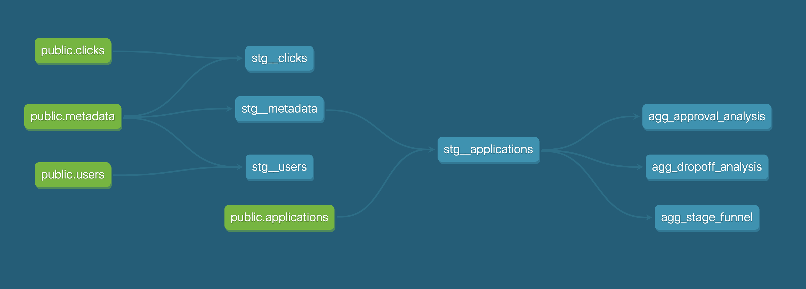

# Spark ETL & DBT Analysis

Given a set of vendor data, the goal is to extract this data, breakout the data into fact tables with  
minimal transformations, load it into a Relational Database and finally do some analytics breakdown. In this process,
logging and testing will take place to ensure that the breaking points are flagged and also the quality of data makes
sense.

 
and in the process pinpoint any corrupt data to log

This demo will capture all the areas
of Engineering ranging from: `designing`, `mocking`, `processing`,`testing`, `analytics`, `visualizing` and `automating`.
I hope with this project, I can provide a holistic overview of the services that can be provided.   


### Software Used
1. `Python`
    1. pyspark  
2. `DBT`
    1. Postgres Adapter
3. `Docker`


### Project Overview


I used pyspark to load in the CDC data, flag any corrupt data points, transform the data
into different dimension tables and finally load it into Postgres. Given the goal is 
to have a local environment for the purpose of this assignment, `postgresql` was used
to host this data (not ideal for Analytics database but will go into depth in `Areas to Improve`.
Once the data is available in Postgres, I used DBT to do some tests to validate the quality of data
and then filtered the data according to how CDC works and needs to be interpret in an Analytics world.
I used the latest operation for each primary record and removed duplicates. From there I answered the analytics
requests using DBT data models. The final step of running this code is enabling `dbt docs` available
to ones browser which contains the data lineage, the defined models and all tests available in a digestable manner
where any stakeholder (engineer, product, marketing, etc) is able to interpret what each data model represents and all the 
transformations that occurred to get to the final state. Since DBT manages SQL it helps tremendously with finding 
easy approaches/solutions to complex problems.

I hope to highlight through this assessment coding readability, usability, layer of abstraction so methods/processes
and finally ease of local development. 


<p align="center">
  
</p>


### Project Summary

Below is a quick summary of the code that is used.

`pyspark`
1. `src/ingestion_process/etl_process.py` -> This is the main method and contains several 
methods/objects but the main ones that dictates what this script does are: `ExtractData`, `Transformations`,
and `TransferData`. Logging is throughout this process, from logging corrupt data points in the format that is
requested, logging errors if the quantity of corrupt data takes more than 10% of the data or
a threshold provided by an env. variable and finally loading it into a database, in this assessment `postgresql`.  

`dbt`
1. `dbt-postgres` -> Contains the code for the dbt project broken down to three layers: `models/0_sources`, `models/1_staging`,
`models/2_marts`; the sources is defining and testing the initial data, `1_staging` represents data we transform which is
filtering the CDC data into a format that can be used for this Analytics purposes (getting the latest operation per primary key 
and filtering out operation delete) and finally `2_marts` contains the analysis. Below contains the data linage of the 
models. The definitions of the models can be available in `dbt docs`.

DBT Docs can be found in the link: https://aselvendran.github.io/spark-etl-dbt-analysis/#!/overview

<p align="center">
  
</p>


### How to Execute

#### Prerequisites
1. `docker`
2. `docker compose`
3. For simplicity, zip file stored in `src/ingestion_process`

We are able to run end to end locally and only two command are needed. One is to create a network
and another is docker compose. 
   ```sh
   docker network create etl-driver
   docker-compose up
   ```
   
Logs are available when executing the script and dbt logs can be available in the project path `dbt-postgres/logs`.

    
#### Useful commands
   ```sh
   docker network create etl-driver
   docker build -t dbt_analysis  -f Dockerfile.dbt .
   docker run --env-file .env --rm -it --entrypoint bash --net etl-driver --mount type=bind,source=${PWD}/dbt-postgres,target=/home/spark_dbt_analysis/dbt-postgres --mount type=volume,target=/home/spark_dbt_analysis/dbt-postgres/dbt_packages dbt_analysis
   docker build -t spark_test  -f Dockerfile .
   docker run --env-file .env --rm -it --entrypoint bash  --net etl-driver spark_test
   
   ```


## Tests
- [x] `pyspark`
    - [x] Unit Test on Logging Error if count of corrupt records is above a threshold relative to the raw data (pass).
- [x] `dbt`
    - [x] user_id is unique (pass).
    - [x] valid timestamp on timestamp columns (test fails for applications' application_complete).
    - [x] model test `agg_approval_analysis` that `approved` & `not_approved` percentage equals to 100 (pass).
    - [x] no special characters for user data (test fails for users' first name, last name, username).


## Improvements

If more time permits there are a few places in which I can make improvements and better design decisions:

1. Using Snowflake in favor of `postgresql`; even though `postgresql` makes local development easier; certain querying 
processes are not intuitive example like validating whether a string columns in a timestamp, given a timestamp can be
long/short format, taking that into account to doing testing in `postgresql` is in clean. Also, `postgresql` is not a 
traditional analytics database (performance for aggregated queries).
2. In the `docker-compose` file, I'm using doing a `sleep 240` before running dbt as I will need to wait
for the spark job to complete; instead the depends on should have to be altered where once the spark container is existed;
then we want to run the dbt container.
3. In the dbt schema folders, I copied and pasted several schema definitions instead of using yaml anchoring 
to prevent too much redundant code.
4. The unit test for pyspark, we are returning the error message which makes the test easier as we are not comparing the 
actual logging. Couldn't get `capsys` or `capfd` capture the logging and therefore returned the error message.
5. Depending on the volume of data and will need to consider a streaming option but with data not coming in a 
structured manner (corrupt data), do not know whether spark streaming can support this processing. 
Batching data in an hourly bases might be the route to take given that the data quality can change, as in the example 
provided. 
